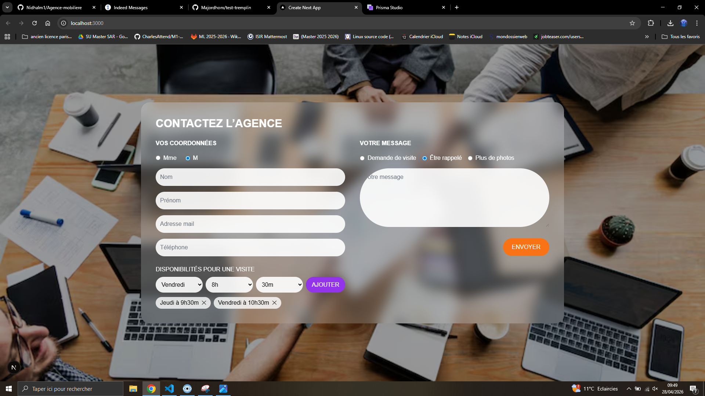
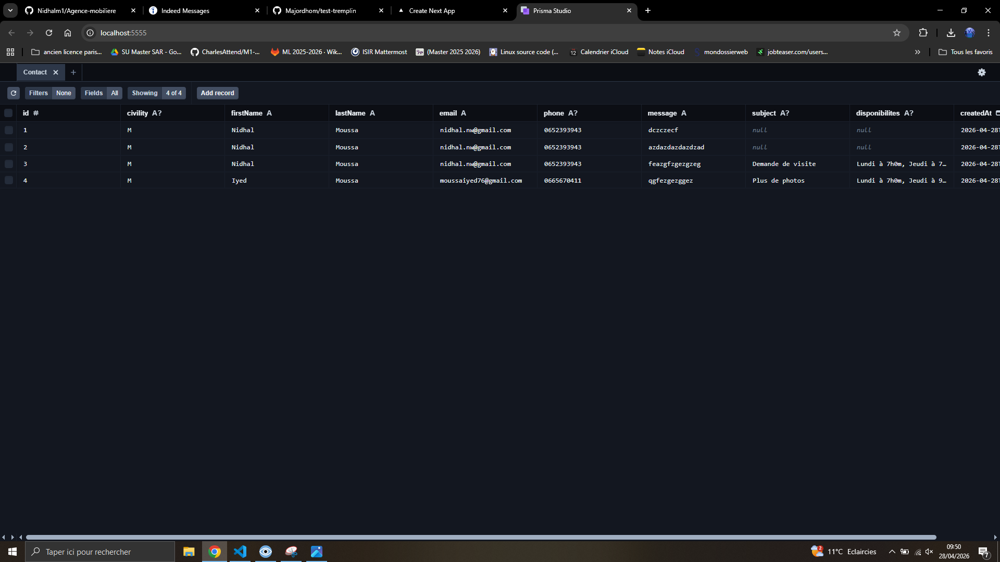

# 🏡 Agence Immobilière – Formulaire de Contact

Application fullstack développée avec **Next.js, Tailwind CSS et Prisma** permettant de contacter une agence immobilière, avec gestion des disponibilités et stockage des messages en base de données.

---
##  Court résumé

**Nom / Prénom** : Nidhal Moussa  
**Niveau d’étude / Formation** : Étudiant en Master 1 Informatique à Sorbonne Université  
**Durée de stage souhaitée** : 2 à 3 mois  
**GitHub** : [https://github.com/Nidhalm1?tab=repositories](https://github.com/Nidhalm1?tab=repositories)


##  Fonctionnalités

* Formulaire de contact complet
* Sélection civilité (Mme / M)
* Choix du type de demande :
    * Demande de visite
    * Être rappelé
    * Plus de photos
* Ajout dynamique de disponibilités
* Message personnalisé
* Feedback utilisateur (toast succès / erreur)
* Sauvegarde en base de données (Prisma + SQLite)

### 🌐 Aperçu du site



### 🗄️ Visualisation des données Prisma



---

## 🛠️ Stack technique

* **Next.js (App Router)**
* **React**
* **Tailwind CSS**
* **Prisma ORM**
* **SQLite**
* **react-hot-toast**

---

## 📁 Installation

### 1. Cloner le projet

```bash
git clone https://github.com/Nidhalm1/Agence-mobiliere.git
cd agence-form
```

---

### 2. Installer les dépendances

```bash
npm install
```

---

### 3. Configurer la base de données

```bash
npx prisma generate
npx prisma migrate dev
```

---

### 4. Lancer le projet

```bash
npm run dev
```

👉 Ouvrir : http://localhost:3000

---

## 🗄️ Accéder aux données

### Interface Prisma

```bash
npx prisma studio
```

👉 Ouvrir : http://localhost:5555

---

## 📡 API

### POST `/api/contact`

Permet d’envoyer un message

#### Exemple de payload :

```json
{
  "civility": "M",
  "firstName": "John",
  "lastName": "Doe",
  "email": "john@email.com",
  "phone": "0600000000",
  "message": "Je suis intéressé par le bien",
  "subject": "Demande de visite",
  "disponibilites": ["Lundi à 10h", "Mardi à 14h"]
}
```

---

### GET `/api/contact`

Récupère tous les messages enregistrés

---

## 🎨 UI

* Design inspiré d’une maquette immobilière
* Effet glassmorphism (blur + transparence)
* Responsive
* Expérience utilisateur fluide

---

## ⚠️ Notes

* Prisma peut nécessiter un redémarrage si erreur Windows (EPERM)
* Utiliser `taskkill /F /IM node.exe` si blocage

---

## 📌 Améliorations possibles

* Validation des champs (Zod)
* Authentification admin
* Dashboard de gestion des contacts
* Stockage avancé des disponibilités (PostgreSQL)


## ❓ Questions

### Avez-vous trouvé l’exercice facile ou difficile ? Qu’est-ce qui vous a posé problème ?

L’exercice était globalement accessible mais comportait plusieurs défis, notamment sur la partie backend.
La mise en place de Prisma, la gestion des migrations et certaines erreurs liées à l’environnement (Windows, fichiers verrouillés, configuration Prisma récente) ont été les principaux points de difficulté.
L’intégration frontend (UI, interactions, gestion du formulaire) a été plus fluide.

---

### Avez-vous appris de nouveaux outils pour répondre à l’exercice ? Si oui, lesquels ?

Oui, j’ai approfondi l’utilisation de :

* **Prisma** pour la gestion de base de données
* **Next.js App Router** pour structurer une application fullstack
* **react-hot-toast** pour améliorer l’expérience utilisateur

J’ai également mieux compris les interactions entre frontend, API et base de données dans un projet complet.

---

### Quelle est la place du développement web dans votre cursus de formation ?

Le développement web occupe une place importante dans mon cursus.
Il me permet de travailler à la fois sur la logique applicative (backend) et l’expérience utilisateur (frontend), tout en développant des compétences en architecture, en gestion de données et en intégration.

---

### Avez-vous utilisé un LLM ? Si oui, comment intégrez-vous les LLM à chaque étape de votre workflow ?

Oui, j’ai utilisé un LLM comme support pendant le développement.
Je l’ai utilisé principalement pour :

* débloquer des erreurs techniques
* comprendre certains concepts (Prisma, Next.js)
* accélérer la mise en place de certaines fonctionnalités

Cependant, j’ai toujours pris le temps de comprendre les solutions proposées et de les adapter au contexte du projet. Le LLM est donc utilisé comme un outil d’assistance et non comme une solution automatique.


---

## 👨‍💻 Auteur

Projet réalisé dans le cadre d’un test technique / entraînement fullstack.

---
